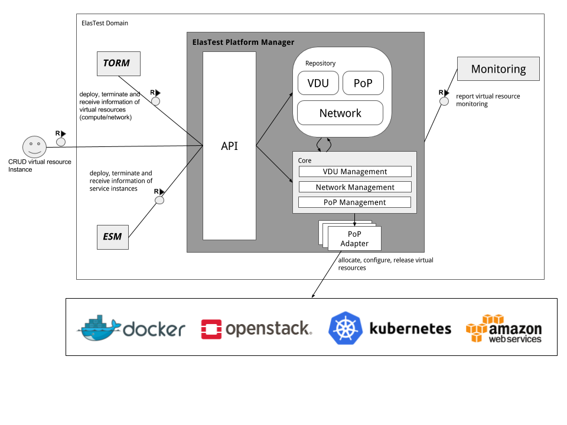

# Elastest Platform Manager (EPM)

The ElasTest Platform Manager is the interface between the ElasTest testing components (e.g. TORM, Test Support Services, etc.) and the cloud infrastructure where ElasTest is deployed. Hence, this Platform Manager must abstract the cloud services so that ElasTest becomes fully agnostic to them and provide this abstraction via Software Development Toolkits (SDK) or REST APIs to the northbound consumers (i.e. the TORM). The ElasTest Platform Manager enabling ElasTest to be deployed and to execute seamlessly in the target cloud infrastructure that the consortium considers as appropriate (e.g. OpenStack, CloudStack, Mantl, AWS, etc.).

## Getting Started

This documentation gives an introduction of the Elastest Platform Manager and includes the following sections:

* [Architecture](#architecture)
* [Features](#features)
* [Installation](#installation)
* [APIs and Information Model](#apis-and-information-model)
* [Usage](#usage)
* [PoP Adapters](#adapters)
* [SDKs](#sdks)
* [Development](#development)

### Architecture
This section gives an overview of the overall architecture of the ElasTest Platform Manager. As shown in the architecrual overview below, it consists of 4 main modules:

* API: The API exposes a ReSTful API in order to allow the consumer (e.g. TORM, ESM) to manage virtual resources in a target cloud environment. It allows to allocate, terminate, update virtual resources (e.g. compute, network) and request information of those as well.
Repository: The repository persists information of managed VDUs and networks, and PoPs as well. The following gives an overview of what those entities are:
    * PoP: A PoP is a Point-of-Presence that defines details of a cloud environment. This includes information about the endpoint, type and access details.
    * VDU: A VDU is a VIrtual Deployment Unit which reflects an abstraction of virtual compute resources. It contains information about software, network connectivity and the target cloud environment.
    * Network: A network reflects the virtualized network resources which provides connectivity between VDUs.
    * Package: A Package contains a Template, describing the VDUs and Networks that should be created and a Metadata file, containing information needed by the EPM for properly managing the package. The Template inside should be created and suited for one of the supported Cloud environments. After deployment the resources can be managed using the internal VDU and Network models.
* Core: The core consists of several management units and provides the basic management functionality in order to manage PoPs, VDUs and networks. The core has access to the Repository in order to persist and request information of managed entities (PoP, VDU, Network). In order to issue operations on different types of cloud environments (docker, OpenStack, kubernetes, AWS), the Core component makes use of PoP adapters which allows the Core to interact with the PoP over well-defined interfaces.
    * PoP Management: This component handles the PoPs. It is in charge of registering, unregistering and providing information of a requested PoP. 
    * VDU Management: This component manages virtualized resource related to the compute domain. It allocates compute resources, connects them to networks, receives details of allocated resources and releases resources in the target PoP.
    * Network Management: This component manages virtualized resource related to the network domain. It creates and deletes network in the target PoP.
    * Runtime Management: This component executes runtime operations, such as, downloading/uploading file, executing commands, start/stop instances, etc.
* PoP Adapter: A PoP Adapter provides an abstracted way to interact with any kind of cloud environment. The northbound interface is exposed to the Core and abstracted in such a way, that the Core do not need to take care about the type of the target cloud environment. The southbound interface is dependent on the type of cloud environment under consideration. This allows an easy way to provide any kind of cloud environment by providing an adapter without changing anything in the core. The PoP Adapter takes also care about the configuration of logging and monitoring of the virtualized resources by receiving those information by the Core component.

### Features

The current version of the EPM offers the following features:

* Supports the following Virtualized Infrastructures:
    * Docker (managing Containers, Networks and Images)
    * Docker Compose (managing Services and Networks, defined in Docker Compose files)
* Runtime operations (download/upload files; execute commands; start/stop instances)
* Forwarding of logs via logstash (only supported in full stack deployment)
* Monitoring of containers via dockbeat (only supported in full stack deployment)

### Installation 

Installation guides and how to run the EPM can be found [here][installation_guide].

### APIs and Information Model

The following links gives you an overview and descriptions of the API exposed by the EPM:

* [Full API descriptions][api_online]
* [API Overview][api_overview]
* [API Definitions][api_definitions]
* [API paths][api_paths]

### Usage

How to use the EPM in order to manager virtual resources is described [here][usage_guide].

### Adapters

The EPM implements PoP Adapters to be able to interact with different kinds of Cloud Environments. Documentation can be found [here][adapters_guide].

### SDKs

The EPM offers SDKs for developers in order to integrate with other components. Documentation can be found [here][sdk_guide].

### Development

The Development Guide can be found [here][development_guide].

[installation_guide]: usage/installation.md
[usage_guide]: usage/usage.md
[sdk_guide]: usage/sdks.md
[adapters_guide]: usage/adapters.md
[api_online]: http://elastest.io/docs/api/epm/
[api_overview]: api/overview.md
[api_definitions]: api/definitions.md
[api_paths]: api/paths.md
[development_guide]: dev-docs.md

